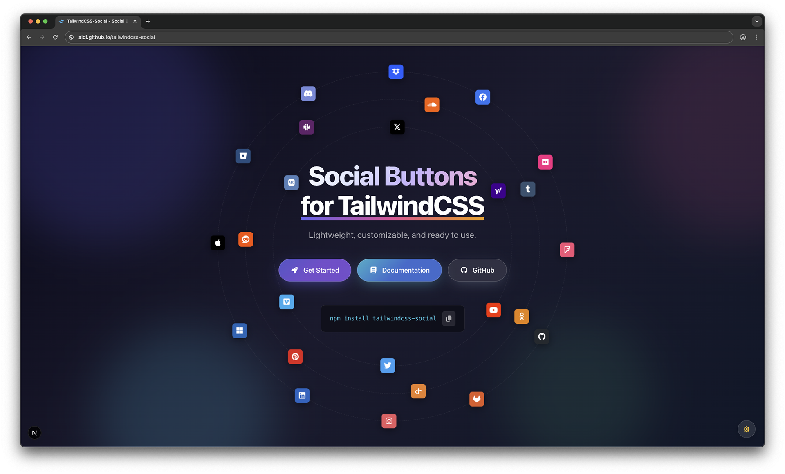

<h1 align="center">TailwindCSS-Social</h1>

<p align="center">
  <strong>Social Buttons and Brand Colors for Tailwind CSS</strong>
</p>

<p align="center">
  <a href="https://npmjs.com/package/tailwindcss-social"></a>
  <a href="https://www.jsdelivr.com/package/npm/tailwindcss-social"></a>
  <a href="https://npmjs.com/package/tailwindcss-social"></a>
  <a href="https://github.com/aldi/tailwindcss-social/blob/main/LICENSE"></a>
  <a href="https://awesome.re"></a>
</p>

<p align="center">
  <a href="https://aldi.github.io/tailwindcss-social/docs/providers"><strong>🎨 Live Demo</strong></a> ·
  <a href="https://aldi.github.io/tailwindcss-social"><strong>📖 Documentation</strong></a>
</p>



## ✨ Features

- 🎨 **25 Providers** — All major social platforms included
- 🧩 **Tailwind CSS Native** — First-class Tailwind CSS plugin with namespaced `tw-social-*` classes
- 📦 **Modular Imports** — Import only what you need, keep your bundle minimal
- 🎭 **4 Variants** — Light, dark, outlined, and inverted button styles
- 🔧 **Framework Agnostic** — Works with React, Vue, Angular, Svelte, or plain HTML
- 🎯 **Any Icon Library** — Compatible with Font Awesome, Material Icons, Ionicons, and more
- ♿ **Accessible** — Built-in focus and disabled states
- 🎛️ **Token-Driven** — Full CSS variable contract for custom theming

## 📦 Installation

### NPM

```bash
npm install tailwindcss-social
```

### Yarn

```bash
yarn add tailwindcss-social
```

### pnpm

```bash
pnpm add tailwindcss-social
```

### CDN

Use via [jsDelivr](https://www.jsdelivr.com/package/npm/tailwindcss-social) — no installation required:

```html
<!-- All social providers -->
<link rel="stylesheet" href="https://cdn.jsdelivr.net/npm/tailwindcss-social@1/css/all.min.css" />

<!-- Or load specific providers -->
<link rel="stylesheet" href="https://cdn.jsdelivr.net/npm/tailwindcss-social@1/css/single/github/github.min.css" />
```

## 🚀 Usage

### Standalone CSS

Import all providers or only the ones you need:

```js
// All providers
import 'tailwindcss-social/css/all.min.css';

// Or import specific providers for smaller bundle size
import 'tailwindcss-social/css/single/github/github.min.css';
import 'tailwindcss-social/css/single/linkedin/linkedin.min.css';
```

### Tailwind Plugin

```js
import tailwindcssSocial from 'tailwindcss-social';

export default {
  plugins: [tailwindcssSocial()],
};
```

Limit providers for a smaller footprint:

```js
import tailwindcssSocial from 'tailwindcss-social';

export default {
  plugins: [
    tailwindcssSocial({
      providers: ['github', 'linkedin', 'youtube'],
    }),
  ],
};
```

## 🎨 Supported Providers

| | | | |
|:---:|:---:|:---:|:---:|
| `apple` | `bitbucket` | `discord` | `dropbox` |
| `facebook` | `flickr` | `foursquare` | `github` |
| `gitlab` | `instagram` | `linkedin` | `microsoft` |
| `odnoklassniki` | `openid` | `pinterest` | `reddit` |
| `slack` | `soundcloud` | `tumblr` | `twitter` |
| `vimeo` | `vk` | `x` | `yahoo` |
| `youtube` | | | |

## 💡 Usage Examples

### Buttons with Text

```html
<button class="tw-social-btn tw-social-provider-github">
  <i class="fa-brands fa-github"></i>
  <span>Continue with GitHub</span>
</button>

<button class="tw-social-btn tw-social-provider-github tw-social-variant-outline">
  <i class="fa-brands fa-github"></i>
  <span>Outlined</span>
</button>
```

### Icon-Only Buttons

```html
<button class="tw-social-btn tw-social-provider-github tw-social-icon-only" aria-label="GitHub">
  <i class="fa-brands fa-github"></i>
</button>
```

## 🎭 Button Styles & States

### Styles

| Class | Description |
|---|---|
| `.tw-social-variant-light` | Light variant |
| `.tw-social-variant-dark` | Dark variant |
| `.tw-social-variant-outline` | Outlined variant |
| `.tw-social-variant-inverted` | Inverted variant |

### Sizes

| Class | Description |
|---|---|
| `.tw-social-size-sm` | Small |
| `.tw-social-size-md` | Medium (default) |
| `.tw-social-size-lg` | Large |

### Icon Modifiers

| Class / Attribute | Description |
|---|---|
| `.tw-social-icon-only` | Icon-only button |
| `.tw-social-icon-left` | Icon on the left |
| `.tw-social-icon-right` | Icon on the right |
| `data-icon="inline-start"` | Logical inline start |
| `data-icon="inline-end"` | Logical inline end |

## 🖌️ Color Utilities

For each provider (e.g. `github`):

| Utility | Classes |
|---|---|
| Background | `.tw-social-bg-github` `.tw-social-bg-github-light` `.tw-social-bg-github-dark` |
| Text | `.tw-social-text-github` `.tw-social-text-github-light` `.tw-social-text-github-dark` |
| Border | `.tw-social-border-github` `.tw-social-border-github-light` `.tw-social-border-github-dark` |
| Ring | `.tw-social-ring-github` `.tw-social-ring-github-light` `.tw-social-ring-github-dark` |
| SVG Fill | `.tw-social-fill-github` `.tw-social-fill-github-light` `.tw-social-fill-github-dark` |
| SVG Stroke | `.tw-social-stroke-github` `.tw-social-stroke-github-light` `.tw-social-stroke-github-dark` |

> 💡 Replace `github` with any supported provider name.

## 🎛️ CSS Variables

Provider classes expose the following variables:

```css
--tw-social-color
--tw-social-color-light
--tw-social-color-dark
--tw-social-on-color
```

Button runtime variables:

```css
--tw-social-btn-bg
--tw-social-btn-fg
--tw-social-btn-border
--tw-social-btn-ring
```

## 📖 Documentation

Full documentation with interactive examples is available at:

👉 [aldi.github.io/tailwindcss-social](https://aldi.github.io/tailwindcss-social)

## 🤝 Contributing

Contributions are welcome! Please read our [Contributing Guide](https://github.com/aldi/tailwindcss-social/blob/main/CONTRIBUTING.md) before submitting a Pull Request.

1. Fork the repository
2. Create your feature branch (`git checkout -b new-provider`)
3. Commit your changes (`git commit -m 'Add new provider'`)
4. Push to the branch (`git push origin new-provider`)
5. Open a Pull Request

## 📄 License

Released under the [MIT License](LICENSE).
